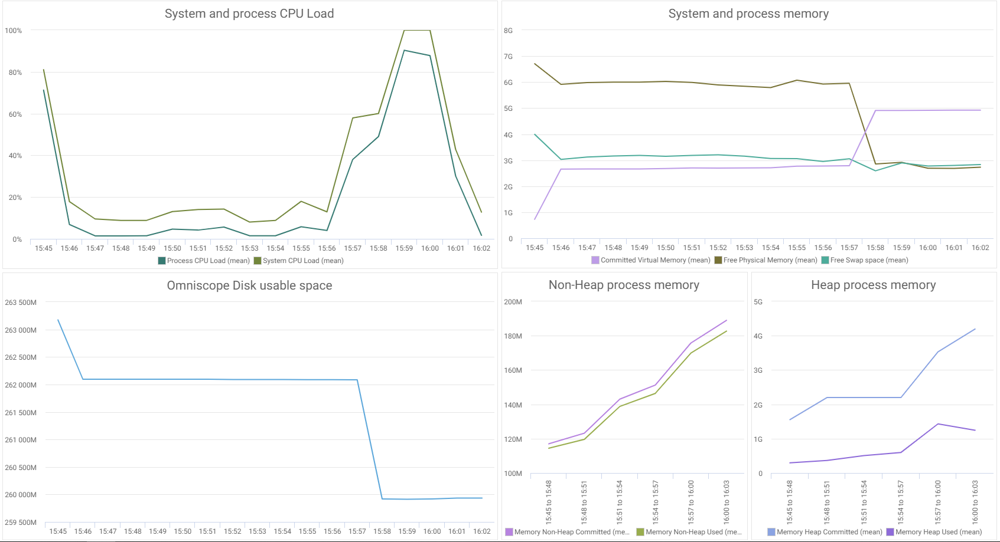
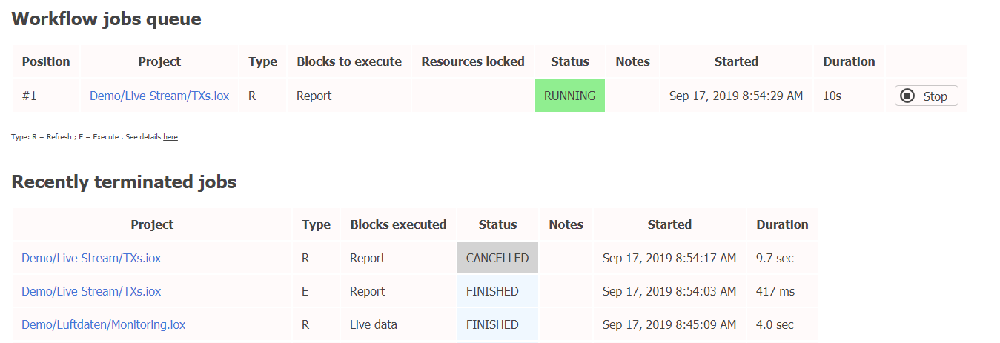

[Home](index.md) | [Getting Started](getting-started.md) | [Linux Installation](linux-installation.md) | [Enable AI](enable-ai.md) | [Local AI Model](local-ai-model.md) | [Impala + Big Data](omniscope-impala-big-data.md) | [In-Memory](running-in-memory.md)

---

# Concurrent Workflow Jobs Execution

## Default behaviour

By default, Omniscope permits only 1 Workflow job to run at the same time. Other jobs are queued and processed sequentially (FIFO) once the current job completes. This conservative approach ensures optimal resource allocation for single-user desktop deployments.

## Enabling concurrent jobs

The default single-job model may prove inadequate for resource-intensive operations or long-running tasks like live data streaming, as it delays execution of simpler jobs. To address this, you can enable concurrent job processing where each job runs as an independent thread that will run concurrently on the system, sharing the available resources.

> **Important:** Currently only 1 job is allowed to be running per Omniscope project. However, the Lambda Workflow Execution API allows parameterized parallel executions outside existing projects.

## Configuration

Access **Admin app > Advanced settings** to modify the **Concurrent Workflow Jobs** setting, which establishes the maximum concurrent jobs allowed system-wide. The cap automatically reflects your machine's CPU core count, as exceeding this typically diminishes performance rather than improving it.

Verify that you have sufficient system resources before enabling concurrent workflow execution to maintain stability.

## Monitoring tools

Omniscope provides two monitoring interfaces:

### Resource Monitor

Navigate to **Admin > Health** to access the Resource Monitor, which tracks CPU load, memory, and disk usage over time.

### Workflow Job Queue

Navigate to **Admin > Workflow Job Queue** to view current and recently completed jobs, including execution blocks, duration, and status. You can terminate running jobs from this interface.

