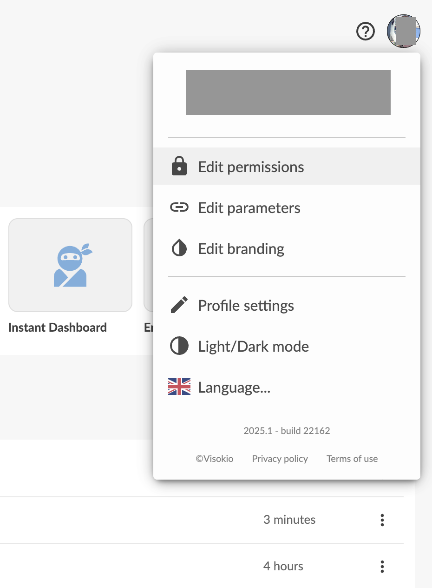
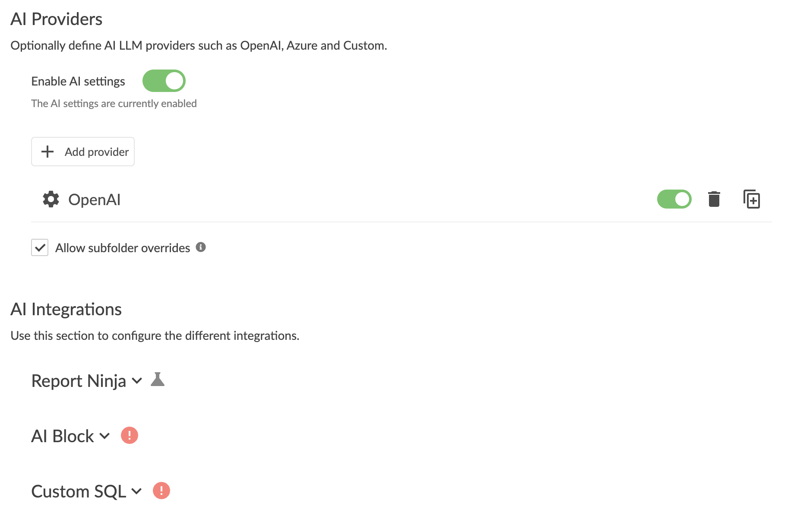
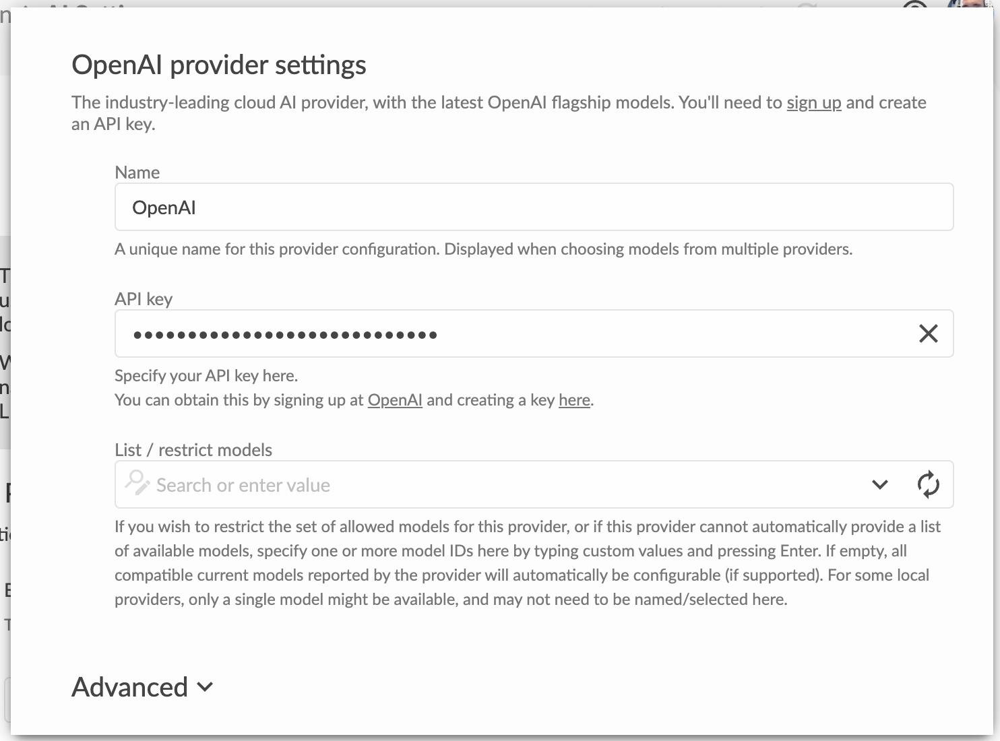
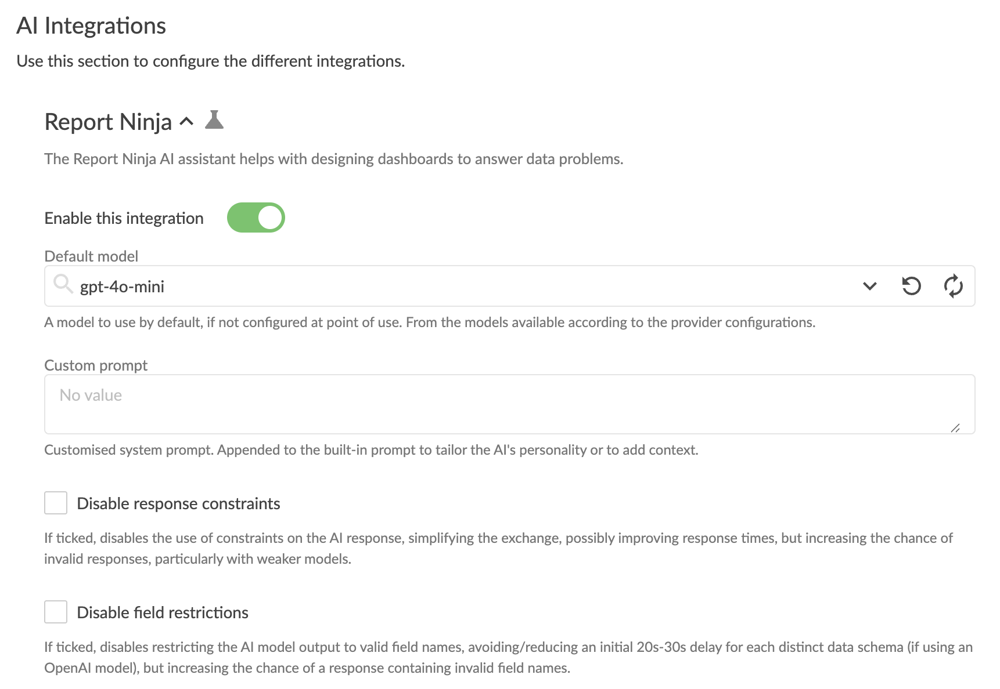
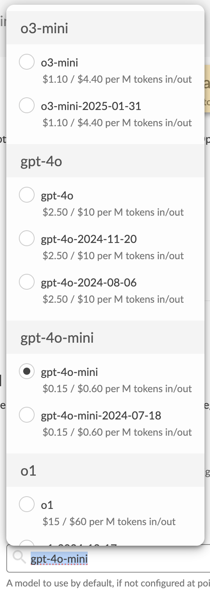
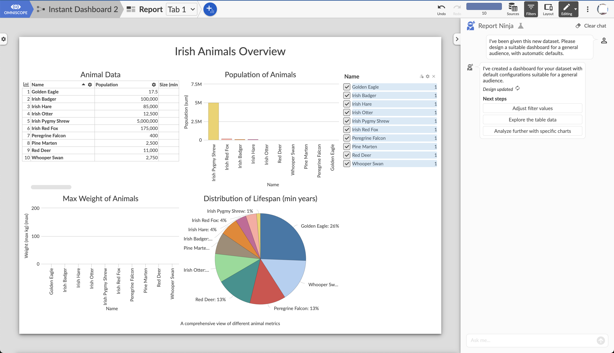

[Home](index.md) | [Getting Started](getting-started.md) | [Linux Installation](linux-installation.md) | [Local AI Model](local-ai-model.md) | [Impala + Big Data](omniscope-impala-big-data.md) | [Concurrent Jobs](concurrent-workflow-jobs.md) | [In-Memory](running-in-memory.md)

---

# How to Enable AI in Omniscope

Omniscope integrates AI capabilities in various places, but they are not enabled by default and need some configuration steps.

## 1. Enable Labs features

Certain AI settings require Labs features to be activated. For instance, **Report Ninja** needs to be enabled. Navigate to **Admin > Labs** and check the "Report Ninja" option, then save and reload the page.

## 2. Find AI Settings

Omniscope's AI configurations are adjustable at the folder level within the **Create/Edit Permissions dialog**, accessible from the corner menu in the folder list page.

For convenience, root folder AI settings (applying server-wide if subfolders don't override them) can be accessed via **Admin > AI Settings**.

## 3. AI Settings overview

The AI settings dialog includes two primary components:

**Providers** are large language model services that Omniscope connects to for AI tasks. Common options include OpenAI, Azure OpenAI, or custom OpenAI-compatible providers like local models via llama.cpp. Commercial providers require API keys and may need paid subscriptions.

**Integrations** are Omniscope features utilising AI capabilities. Currently there are six: Report Ninja, Workflow Ninja, Data Q&A View, AI Block, Custom SQL, and Workflow Executions.

Configuration can be folder-specific or inherited from parent folders. Administrators can restrict subfolders from overriding settings to enforce organisational AI policies.

## 4. Set up a provider

By default, no providers exist, preventing AI feature usage. Most users start with OpenAI:

1. Visit [https://platform.openai.com/](https://platform.openai.com/)
2. Navigate to **Settings > API keys**
3. Create an all-permissions key

4. Return to Omniscope and add an OpenAI provider with the API key

No additional settings are necessary.

For on-premises or OpenAI-compatible alternatives, configure a "Custom" provider (Enterprise licence required). See [Using a Local AI Model](local-ai-model.md) for details.

## 5. Configure integrations

Integrations are enabled by default but require a configured provider and selected default model.

For Report Ninja, **gpt-4o-mini** is a cost-effective and capable option. **gpt-4o** and **o3-mini** also work well.

Once configured, "Instant Dashboard" appears in the "Create project" section and becomes available as a Workflow preset. Existing reports can access Report Ninja via the corner menu "Ask Report Ninja," providing assistance with suggestions, questions, and edits.

## Available AI integrations

**Report Ninja** — Assists with dashboard creation and editing.

**Workflow Ninja** — Explains complex workflows, displaying data flow and transformations with diagrams and block links.

**Data Q&A View** — Enables natural language queries across multiple data sources, returning answers with diagrams and explanations.

**AI Block** — Creates custom workflow operations using AI-generated Python code responding to instructions.

**Custom SQL** — Generates SQL queries from natural language, available in Database block Options after enabling this integration.

**Workflow Executions** — Provides AI assistance in executions, including the AI Completion block for text generation and transformation.

## Summary

1. Enable the Report Ninja feature flag in Admin > Labs (if required)
2. Add a provider with an API key (typically OpenAI)
3. Select a default model (e.g. gpt-4o-mini) in integration settings
