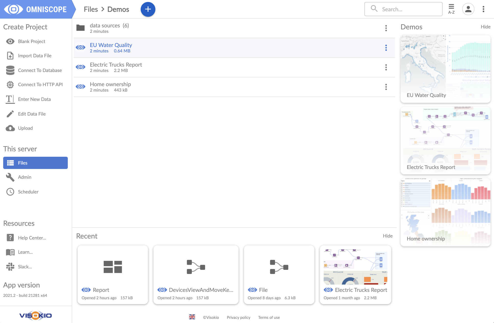
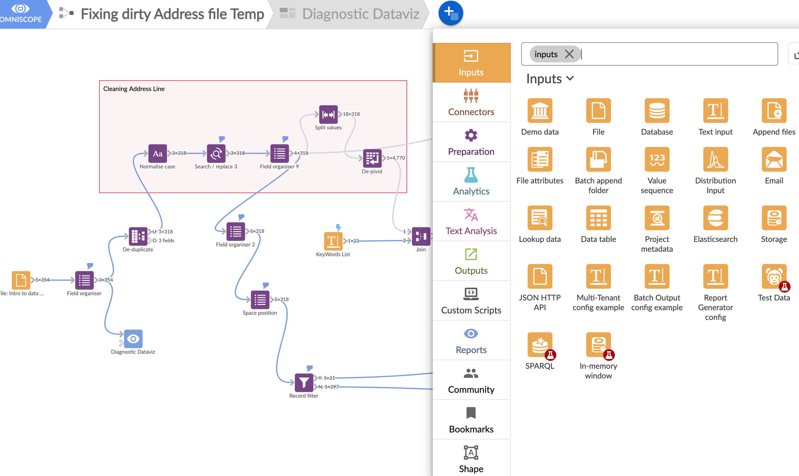
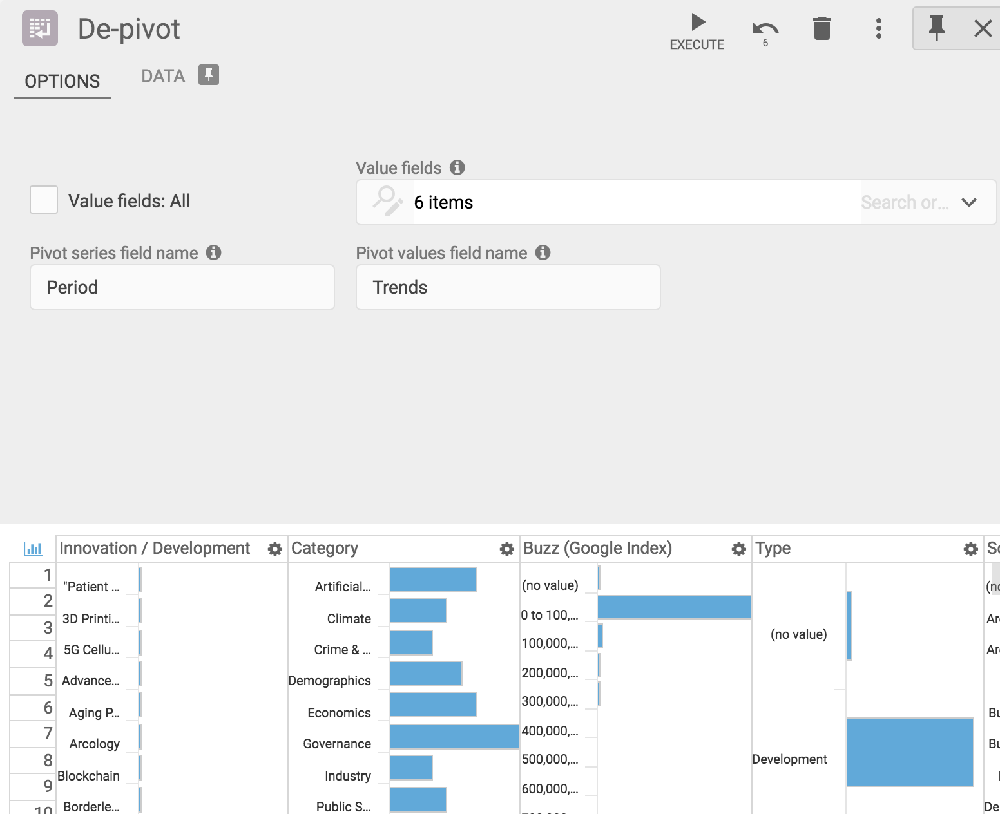

## Download and install the app

On the [Omniscope download page](http://www.visokio.com/get/) you will find two builds — "Rock" and "Preview build", the first one being older and more stable, the newer one coming with all the latest features.

After the download, install the app (following instructions [here](https://help.visokio.com/support/solutions/folders/42000039433) if necessary) and start Omniscope by clicking on the blue Omniscope icon on your desktop.

## It is a web application — use any device to interact with it

Omniscope will open in your browser, where you can create new files and folders or upload data files to use as sources. You can drag and drop a file into the centre of the target folder. Storing data in the same folder as the project is optional. An Omniscope workflow can connect to remote data sources, including files, APIs, local network databases and cloud databases, and retrieve new data on every project or block refresh.

All menus are touch friendly, allowing you to create and access reports on different devices. You could create a report in the office, then make edits at home or on the train.

Omniscope runs on Windows, Mac and Linux machines, and also on any web-enabled touchscreen device such as iPads, Android tablets and mobile phones.

## Create a project

From the Welcome screen you can pick one of the options such as Connect to Database, Import Data File, Edit Data or create a Blank Project, where you will be able to assemble the data transformation workflow and interactive visualisations.

> Note: if your data sources and projects are stored on the same machine or installation that hosts Omniscope, you will be able to do all this even if you have no internet connection.

When you open a new project you will see the Workflow app. If you picked one of the preconfigured models there will be a data source block connected to a blue report block. If you picked a blank project you will have an empty canvas with the plus button, where you can find the building blocks and operations you need to create the data transformation, analysis and visualisation pipeline: Inputs, Connectors, Preparation, Analytics, Text Analysis, Outputs and Reports.

Expanding each of these menus will allow you to drag a block to the workspace. All blocks are colour coded, so you can quickly see the project composition. The first set of building blocks are your data sources, so open and drag a File block if you want to use data from an Excel spreadsheet, or a Database block to extract data from a database.

You can also drag a source file and drop it onto the Omniscope Welcome page or into the workflow space. This step will upload the source file to the same project folder or, in the second case, embed the file within the project.

## Inputs menu

**Demo Data** — Comes with multiple useful demo datasets, which are great for testing and training. Some of these datasets are used in our training videos.

**File** — Used for Excel spreadsheets, .csv, .tsv, .txt, legacy IOK files, XML, JSON, IOD and other data files. You can also use the File block to connect to any XML or JSON REST API, setting optional HTTP headers (for example to pass an authentication token).

**Database** — Enables you to connect to local, network or cloud based databases such as Oracle, SQL, Actian Vector, Ingres, MS Access, and others, as well as any database that comes with a JDBC driver.

**Lookup Data** — Comes in handy if your data is missing information needed to display it on a map, as it contains latitude and longitude data for countries and towns around the world.

**Batch Append and Append Files** — Helps you append multiple files from one or several folders, avoiding the need to clutter the screen with too many individual data sources when, for example, you have files with the same structure covering different periods (week1, week2, week3 and so on).

**File Attributes** — Useful when doing file and report inventory, showing files, folders, field metadata and data schema, and also listing report features used in legacy IOK files.

**Connectors** — Uses publicly available or commercial API connectors for external data sources such as social media, advertising, financial data and others.

All individual blocks contain a configuration tab and a data preview tab, notes, plus, in some cases, additional tabs with instructions or other information. After configuring the options on the first tab, you will need to press the "Execute" button at the top of the block. This allows the data to flow through the block, undergo any defined actions, and then appear on the data preview tab, where you can examine the results.

This inspection is made easier by clicking on a column header to sort the data, or by clicking on the cog button to create a mini chart showing the data distribution within each field. Clicking on the small chart icon in the top left-hand corner will create charts for all fields. In the same corner you can find search tools (to locate fields or cell values).

Another useful feature is the pin icon next to the Data tab: this brings the data preview forward and displays it in the bottom half of the configuration tab.

## Preparation menu — data management and transformation

**Append** — Combines multiple data sources and organises them vertically. Typically used to append data that contains the same fields, for example transactions in consecutive time periods.

**Join** — Performs a merge operation on one or more fields and allows separation of non-merged records. Tip: deduplicate and remove blanks on both sides before merging.

**Normalise Case** — Used for textual data; it eliminates multiple variations of the same text (e.g. London and LONDON).

**Bulk Field Organiser** — Provides functionality to edit or delete multiple fields at once.

**Validate Data** — Performs data type checks for all fields, ensuring that the contents follow a correct data schema (e.g. the Date field contains date values).

**Record Filter** — Allows you to set one or more field value criteria and accept or reject records that do not satisfy these criteria. Two data preview tabs display both accepted and rejected records, and both sets can be used as outputs of this block.

**Search/Replace** — Organises data cleaning across one or multiple fields using any number of search terms.

**Aggregate** — Summarises the dataset using one or more criteria. You can select resulting fields and functions such as sum, mean, max, etc.

**De-duplicate and Delete Empty Data** — Useful steps, especially before merging data with another dataset. Note: two blanks are considered a match.

**Pivot, De-pivot and Transpose** — Essential tools for changing data orientation. Pivot and de-pivot can isolate and reorganise several fields while leaving others in place. Transpose changes the orientation of all fields. For example, fields Jan, Feb, March can be merged into a single Date field using de-pivot; Pivot will reverse this.

**Normalise** — Used to normalise values in one or more numeric fields, allowing later analysis and visualisation together. Useful when original values are on different scales.

**Scramble Data** — Replaces sensitive text data with unrecognisable but consistent patterns, enabling users to share outputs while preserving analysis and visualisation results.

**Split Values** — Separates fields using a single-character separator or fixed width. **Collapse** does the opposite, concatenating the contents of multiple fields.

**Sort** — Enforces data ordering according to one or more fields.

**Split Data** — Splits records randomly into two sets with given proportions. Used to create inputs for statistical models, so one subset trains the model and the other tests it.

**Random Sample** — Selects records from the dataset either as a percentage of the dataset size or as a fixed number of records.

**Geocode and Reverse Geocode** — Relies on Esri (paid service) or Nominatim (free service) to assign latitude and longitude based on address information, or vice versa.

## Building data pipelines

Connecting blocks is easy — you will see arrows on one or both sides of the blocks, which you can grab and drag to connect with other blocks. Data sources usually have output only, with the exception of the Database block and connectors, which may accept optional input parameters. The output of one block can be connected to multiple subsequent preparation blocks or reports.

**Best Practice Tip 1:** Whatever your data source, connect it to a Field Organiser block, where you can see a list of all fields and quickly eliminate unnecessary fields, correct data types, or rename fields.

**Best Practice Tip 2:** Name your blocks by clicking on the name at the top of an open block, or create workflow notes from the + button > Shapes at the top of the workflow. This will make subsequent reviewing and editing easier, especially if you are collaboratively working on the file with other users.

Once configured, the workflow allows you to retrieve new data from your data sources and update dashboards and reports by clicking the refresh button. This refresh can be performed on demand by clicking the "play" button, or it can be automated using the Scheduler application, available to Omniscope Server users.

Read more about execution and refresh behaviour in [this article](https://help.visokio.com/solution/articles/42000036491-workflow-execution).

## Omniscope build information and updates

The small Omniscope logo icon at the top of the screen on a Mac, or in the bottom tray on Windows machines, contains shortcuts to options such as the Omniscope Classic application (if you want to work on legacy IOK files), accessing help, diagnostics, log files, and more.

**Tip:** Use the "Exit" option from this menu as a reliable way to quit the application before updating your Omniscope build by downloading the new version. There is no need to delete the existing build, as the new one will replace it. By doing this regularly, you will benefit from all software improvements throughout the year.
