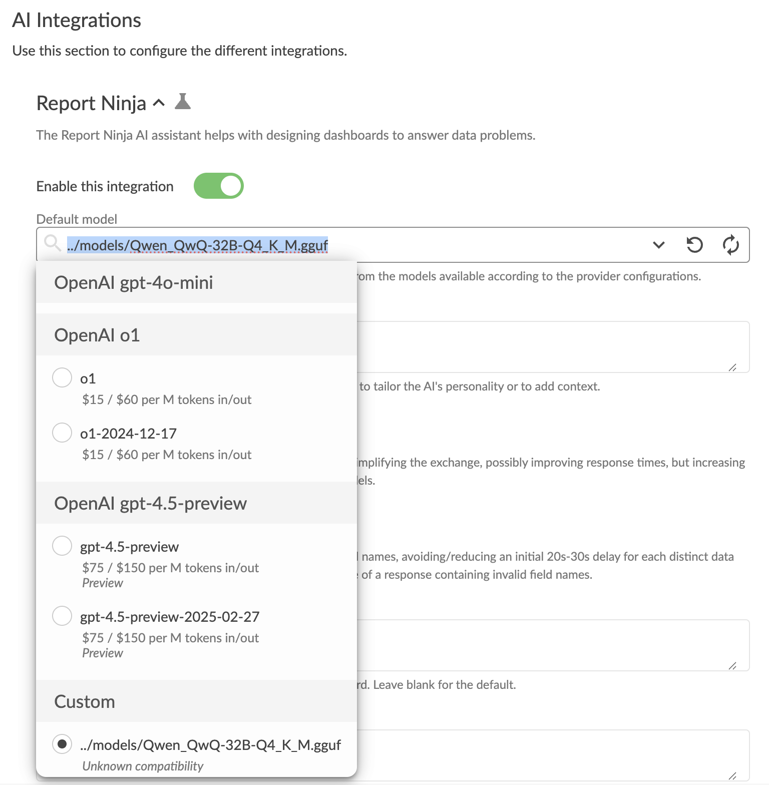
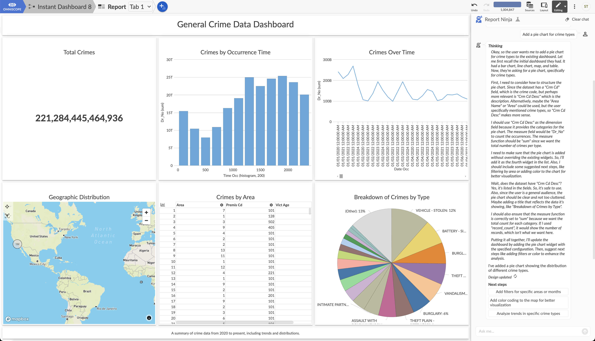

Omniscope Evo with an Enterprise licence lets you configure OpenAI-compatible providers (LLM inference engines providing an OpenAI-compatible chat completions endpoint).

Many models, variants, and providers are available for running locally on laptops, on-premises servers, or self-hosted private clouds. This article focuses on one example: **llama.cpp** on a **MacBook Pro M2** running **Qwen_QwQ-32B-Q4_K_M.gguf**.

## Install llama.cpp

**llama.cpp** supports CPU-only and GPU-accelerated AI models in GGUF format, available under the "Quantizations" section on huggingface.co. This enables larger models to run on smaller hardware.

On Mac (such as MacBook Pro M2 with 32GB memory), install llama.cpp using brew:

```bash
brew install llama.cpp
```

## Download a model

Visit huggingface.co and find your desired model. For example: [https://huggingface.co/Qwen/QwQ-32B](https://huggingface.co/Qwen/QwQ-32B).

Follow the Quantizations section on the right. Select the **q4_k_m** variant if unsure. For this example:

```
qwq-32b-q4_k_m.gguf
```

This is a 32 billion parameter model, quantized to approximately 4.8 bits per weight. The file is approximately 20GB.

## Run the model

In Terminal, adapt and run:

```bash
llama-server --port 8081 -m models/qwq-32b-q4_k_m.gguf
```

### Windows users with NVIDIA GPU

On Windows with an NVIDIA GPU, llama.cpp does not automatically use GPU acceleration like macOS, requiring explicit enablement.

Download or build a CUDA-enabled llama.cpp (`llama-server.exe` built with `GGML_CUDA=ON`). Place your .gguf model locally, then run with GPU control flags.

The key parameter is `--gpu-layers`, controlling how many transformer layers load into VRAM (use high values like 999 to offload everything that fits). Use `-c` for context size (start with 4096).

A typical Windows command:

```bash
llama-server -m models\model.gguf --gpu-layers 999 -c 4096 --port 8081
```

If CUDA works, startup logs show GPU offloading. The `nvidia-smi` command displays VRAM usage. Omitting `--gpu-layers` runs mostly on CPU, which is much slower.

> GPU acceleration is essential for sufficient response times.

## Configure Omniscope

Following the introduction in [How to Enable AI in Omniscope](enable-ai.md), go to AI Settings and add a **Custom** provider. Enterprise licence required; contact support@visokio.com for trials.

Configure the Endpoint base URL. For port 8081 on the same machine:

```
http://127.0.0.1:8081/
```


Then select the model in Report Ninja integration settings' Default model dropdown.



## Try it out

Use Instant Dashboard on the home page to upload a data file and view a dashboard.


> **Note:** Large local 32B models are not "instant" and may require one or more minutes to respond. Increase the Custom provider Advanced settings response timeout if needed.

## Performance

For poor performance, try smaller models like `DeepSeek-R1-Distill-Qwen-7B-Q4_K_M.gguf` (faster but less capable) or use newer, faster hardware like the latest MacBook Pro.



## Caveats

- Local models are typically only compatible with Report Ninja
- The AI Block and Custom SQL typically require real OpenAI models rather than OpenAI-compatible alternatives
- Smaller models will not work sufficiently to be useful
- GPU acceleration is essential for adequate response times
