[Home](index.md) | [Getting Started](getting-started.md) | [Linux Installation](linux-installation.md) | [Enable AI](enable-ai.md) | [Local AI Model](local-ai-model.md) | [Concurrent Jobs](concurrent-workflow-jobs.md) | [In-Memory](running-in-memory.md)

---

# Omniscope + Impala = Big Data Live Reports on Hadoop

This article provides step-by-step guidance for setting up Apache Impala and configuring Omniscope to create interactive reports.

**What this guide covers:**

1. Installing and running Impala
2. Loading sample data on Hadoop filesystem (HDFS) with Omniscope
3. Creating an Impala table from a CSV file on HDFS
4. Connecting Omniscope to Impala
5. Demonstrating an Omniscope report powered by Impala

## Big Data Live

The combination of Omniscope and Impala enables big data visual analytics on your data sitting on Hadoop.

Apache Impala is an open source massively parallel processing (MPP) SQL query engine for data stored in a computer cluster running Apache Hadoop. Omniscope leverages Impala's query engine capabilities to analyse billions of rows with near instantaneous results in your Omniscope reports.

## 1. Set up Impala VM

This section uses the free Cloudera Quickstart VM (single-node cluster) for testing. Users with existing Impala installations may skip this section.

### 1.1 Select VM platform and download image

Download from the [Cloudera Quickstart page](https://www.cloudera.com/downloads/quickstart_vms/5-12.html). Select your preferred VM platform (such as VirtualBox) and download the corresponding image.

### 1.2 Configure VirtualBox VM and run QuickStart VM

- Extract the downloaded zip file
- Import the appliance into VirtualBox to create a new VM

**Recommended configuration before starting the VM:**

1. Set **6 CPUs** and **12GB of RAM** for smooth operation of Cloudera Manager, Hadoop, and Impala
2. Change the network adapter setting to a **bridged connection**

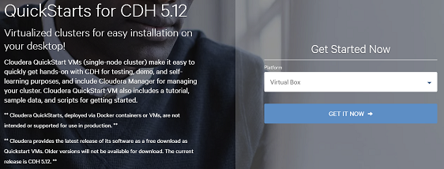

Once configured, run the Cloudera Quickstart VM.

### 1.3 Configure Cloudera CDH

When CentOS starts, the web browser should open to the Cloudera Live page displaying the cluster IP address.

To use Cloudera Manager for managing the single-node cluster:
- Go to the VM desktop
- Click the "Launch Cloudera Express" shortcut
- Wait for services to initialise

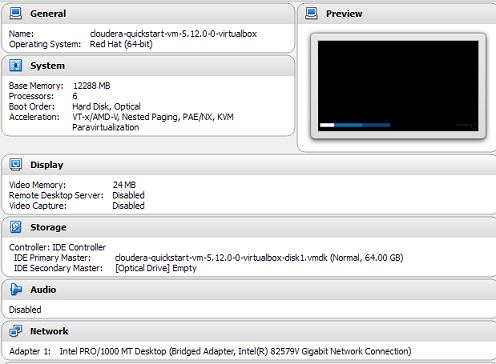

> **Note:** You may need to "Deploy Client configuration" for the cluster and restart it to ensure all services run properly.

## 2. Load data on Hadoop filesystem (HDFS) with Omniscope

Omniscope reads and writes files from/to HDFS using the public WebHDFS API.

1. Create a new Omniscope project
2. In the Workspace App, add a demo data block to generate sample data
3. Add a File output block
4. Configure the location to your HDFS filesystem
5. Execute the block to publish a CSV file

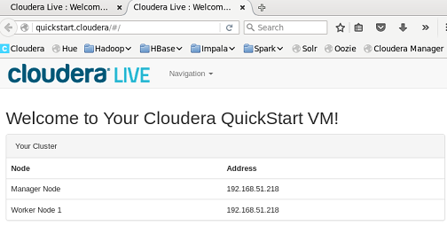

> **Important:** It is highly recommended to use the host name instead of the name node IP address.

Default credentials: username and password are `cloudera`.

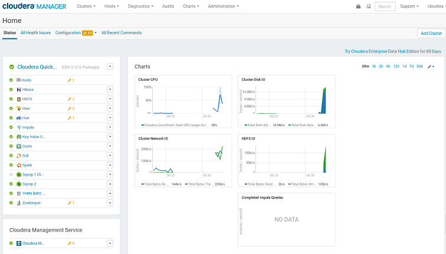

**Verification:**
- Add a File input block to the workspace
- Verify that Omniscope can read data from HDFS
- Go to the Data tab and confirm data readability from the HDFS filesystem

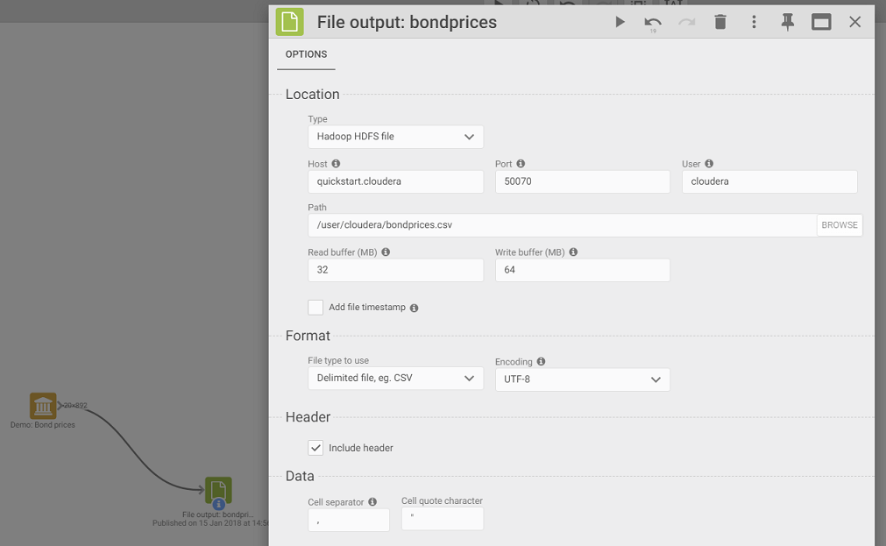

## 3. Create Hive table from CSV file on HDFS

1. Open Apache Hue
2. Navigate to the Tables browser
3. Select the `bondprices.csv` file
4. Leave default settings
5. Click "Next" to configure the table

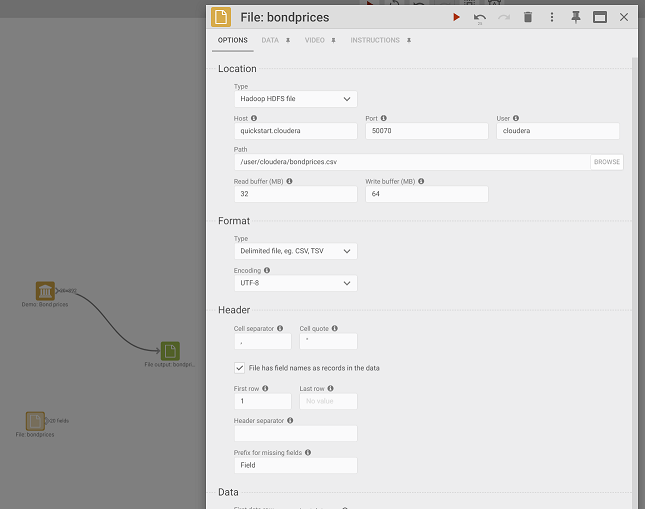

> **Important:** Date type is not supported by Impala at the time of writing, so date-related fields (issue date and maturity date) are created as String fields.

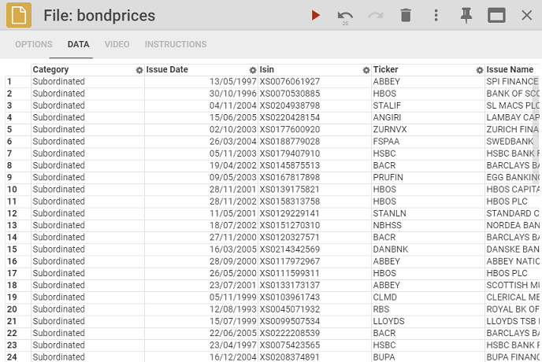

Click "Submit" and wait for the job to create the `bondprices` database table.

**Known issue:** There may be a Hue bug where the first column appears as `?category` instead of `category`. This requires manual correction using the Hive query editor:

```sql
ALTER TABLE bondprices CHANGE `?category` `category` String
```

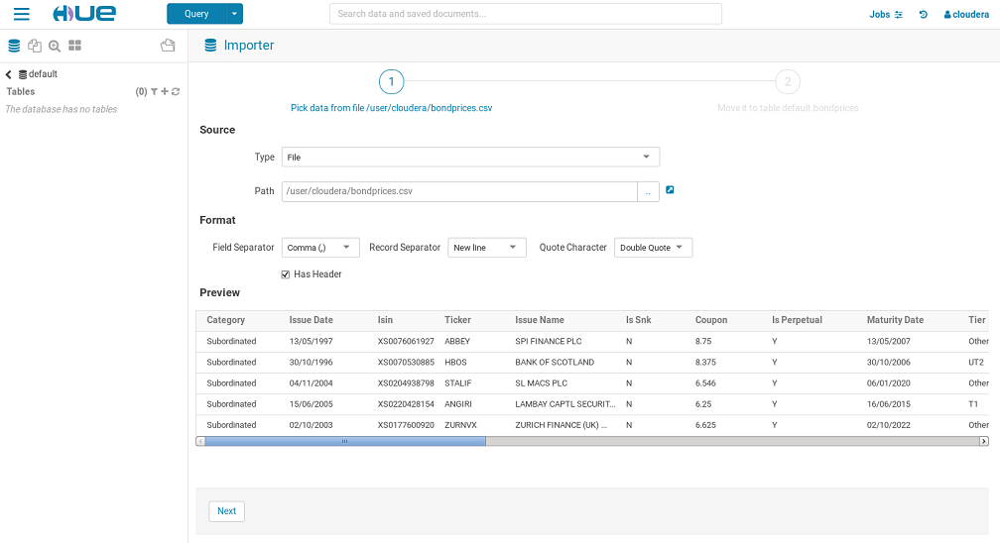

## 4. Connect Omniscope to Impala (JDBC)

With a sample Hive table queryable through Impala, configure Omniscope to connect to Impala.

1. Add a Database input block to the Workspace
2. Configure an advanced JDBC connection

**Required:** Download Impala JDBC drivers for Java 7+ from [Cloudera](https://www.cloudera.com/downloads/connectors/impala/jdbc/2-5-5.html).

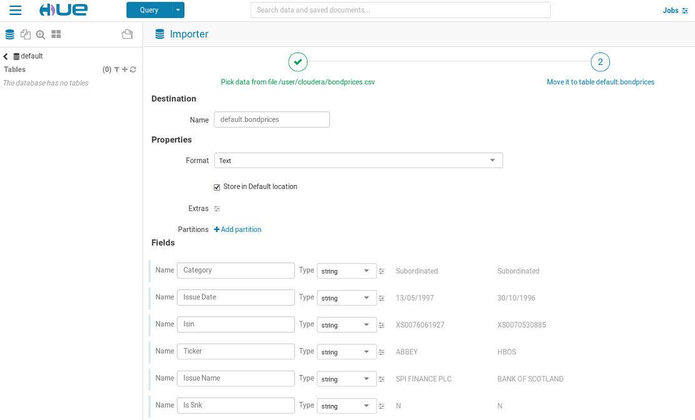

**Connection details:**

```
Class:    com.cloudera.impala.jdbc41.Driver
URL:      jdbc:impala://[yourhostname]:21050;AuthMech=3;UID=impala;PWD=cloudera;UseSasl=0
Driver:   pathTo\impala-jdbc4 (Java7+) 2.5\
Username: cloudera
Password: cloudera
```

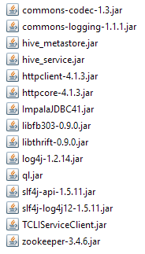

**Enable "Live query" mode** — this allows Omniscope to execute live queries to Impala without having to download data locally.

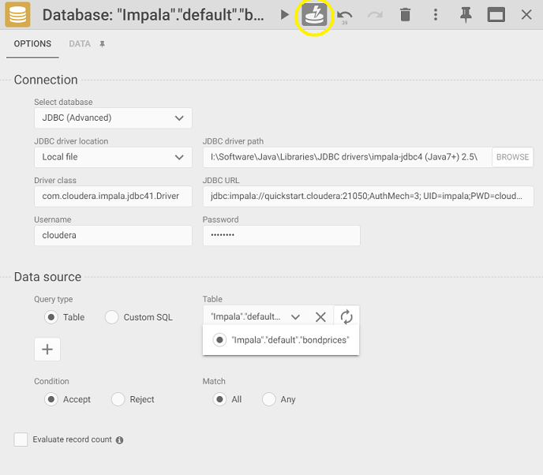

**Verification:**
- Select the `bondprices` table
- Go to the Data tab
- Verify the connection works and Omniscope can query the table data

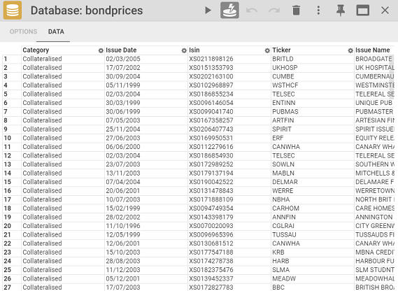

## 5. Create Omniscope report powered by Impala

Back in the Workspace app:

1. Connect the Database block (pointing to the Impala table) to a Report block
2. A "bolt" icon on the database block indicates a live query connection to Impala
3. Click the Report block to begin building the report
4. Report views query data directly through Impala

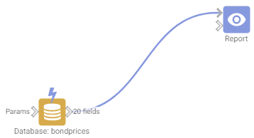

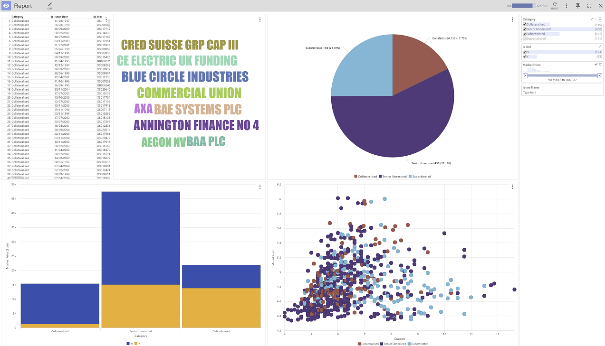

## Resources

A preconfigured IOZ file is available for download from the [original article](https://help.visokio.com/support/solutions/articles/42000036575-omniscope-impala-big-data-live-reports-on-hadoop-step-by-step-guide-), including write/read data to HDFS with a report powered by Impala.
